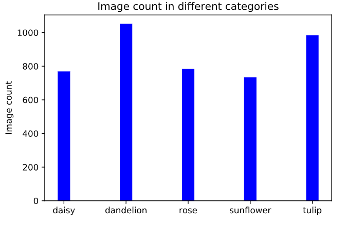

# 花朵分类任务-1
## 1. 图像数据的获取和转换
### 1.1 文件
文件格式：
```
Input/flowers/category_name[ ]/image
------------------------------------
data/train/category_name[ ]/image
data/test/category_name[ ]/image
data/valid/category_name[ ]/image
```
+ 原始图片存在Input，再建一个data文件夹

### 1.2 数据集的划分
+ 具体思路为：先读取Input中某一类图片的地址images[ ]，再打乱顺序`random.shuffle`，划分好数据集`train_valid_test`
得到`train_images, valid_images, test_images`，再将其送入data中对应的某一类的文件夹中 
+ categories = ['daisy', 'dandelion', 'rose', 'sunflower', 'tulip'] # 为类别标签`str`
+ total_images = [769, 1052, 784, 734, 984] # 五类图片数量
+ 代码如下：

```python
total_images = []
for category in categories: #对某一类
    images = os.listdir("{}/{}".format(base_dir, category)) #返回某一类的图片地址 list
    random.shuffle(images) #打乱顺序
    filtered_images = [image for image in images if image not in ['flickr.py', 'flickr.pyc', 'run_me.py']] #过滤出某一类所有纯图片
    
    total_images.append(len(filtered_images)) #list,每一类图片的数量
    
    #从原始文件夹flowers拷贝到data，并且根据比例划分
    train_images, valid_images, test_images = train_valid_test(filtered_images) 
    #拷贝图片
    copy_files(train_images, "{}/{}".format(base_dir, category), "./data/train/{}".format(category))
    copy_files(valid_images, "{}/{}".format(base_dir, category), "./data/valid/{}".format(category))
    copy_files(test_images, "{}/{}".format(base_dir, category), "./data/test/{}".format(category))
    plot_images(category, images[:5]) #显示前五张，每次都是随机的
```
+ 说实话，这种图片划分方式有点乱，没有第二个任务来的清楚
+ 第一种：先将图片打乱，按照所属的文件夹分好，再转换格式
+ 第二种：直接顺序读取，再利用函数划分数据集

  
### 1.3 可视化每类图片的数量
```
#绘制条形图
y_pos = np.arange(len(categories))
plt.bar(y_pos, height=total_images, width=0.2,color='b',align='center')
#x轴的label
plt.xticks(y_pos, categories)
#y轴的label
plt.ylabel("Image count")
plt.title("Image count in different categories")
#显示
plt.show()
```


### 1.3 数据的编码
此时还是图片形式躺在文件夹中<br>
+ 使用`load_dataset()`得到每一类的图片地址(如：train_files)和标签的编码
+ 再将train_files(此时元素还是图片地址)变为4D-tensor
+ 代码如下：
```python
#将一张图片转换成4维的tensor
def path_to_tensor(img_path):
    # loads RGB image as PIL.Image.Image type
    img = image.load_img(img_path, target_size=(224, 224)) #加载图片，统一大小
    # convert PIL.Image.Image type to 3D tensor with shape (224, 224, 3)
    x = image.img_to_array(img)
    # convert 3D tensor to 4D tensor with shape (1, 224, 224, 3) and return 4D tensor
    return np.expand_dims(x, axis=0) #在axis=0的位置添加一个新的维度

#applies path_to_tensor to all images and returns a list of tensors.
#返回一个tensors的list
def paths_to_tensor(img_paths):
    #对每一个图片转为tensor，返回list
    list_of_tensors = [path_to_tensor(img_path) for img_path in tqdm(img_paths)]
    return np.vstack(list_of_tensors)#将list_of_tensors改为垂直堆叠

from PIL import ImageFile                            
ImageFile.LOAD_TRUNCATED_IMAGES = True                 

# pre-process the data for Keras

train_tensors = paths_to_tensor(train_files).astype('float32')/255
valid_tensors = paths_to_tensor(valid_files).astype('float32')/255
test_tensors = paths_to_tensor(test_files).astype('float32')/255
```
+ 好麻烦，还是CV2方便，直接获得array，这玩意儿还要扩展维度
+ **数据读取建议使用第二个任务的方法**

## 2.模型构建
### 2.1 Checkpointer
Callback之`ModelCheckpoint()`
+ 如果valid_loss有下降，则保存模型。即随时保存最新的模型

### 2.2 训练
```python
model.compile(optimizer='rmsprop', loss='categorical_crossentropy', metrics=['accuracy'])

model.fit(train_tensors, train_targets, 
          validation_data=(valid_tensors, valid_targets),
          epochs=epochs, batch_size=20, callbacks=[checkpointer], verbose=1)
```
```python
_________________________________________________________________
Layer (type)                 Output Shape              Param #   
=================================================================
conv2d_43 (Conv2D)           (None, 224, 224, 32)      896       
_________________________________________________________________
conv2d_44 (Conv2D)           (None, 222, 222, 32)      9248      
_________________________________________________________________
max_pooling2d_25 (MaxPooling (None, 111, 111, 32)      0         
_________________________________________________________________
conv2d_45 (Conv2D)           (None, 111, 111, 64)      18496     
_________________________________________________________________
conv2d_46 (Conv2D)           (None, 109, 109, 64)      36928     
_________________________________________________________________
max_pooling2d_26 (MaxPooling (None, 54, 54, 64)        0         
_________________________________________________________________
global_average_pooling2d_2 ( (None, 64)                0         
_________________________________________________________________
dense_14 (Dense)             (None, 5)                 325       
=================================================================
Total params: 65,893
Trainable params: 65,893
Non-trainable params: 0
_________________________________________________________________
```
```python
Epoch 00045: val_loss did not improve from 0.63782
Epoch 46/50
3631/3631 [==============================] - 52s 14ms/step - loss: 0.6643 - acc: 0.7643 - val_loss: 0.8641 - val_acc: 0.7298

Epoch 00046: val_loss did not improve from 0.63782
Epoch 47/50
3631/3631 [==============================] - 51s 14ms/step - loss: 0.6525 - acc: 0.7585 - val_loss: 0.6285 - val_acc: 0.7750

Epoch 00047: val_loss improved from 0.63782 to 0.62852, saving model to saved_models/weights.best.from_scratch.hdf5
Epoch 48/50
3631/3631 [==============================] - 52s 14ms/step - loss: 0.6472 - acc: 0.7725 - val_loss: 0.6470 - val_acc: 0.7642

Epoch 00048: val_loss did not improve from 0.62852
Epoch 49/50
3631/3631 [==============================] - 52s 14ms/step - loss: 0.6329 - acc: 0.7678 - val_loss: 0.7709 - val_acc: 0.7393

Epoch 00049: val_loss did not improve from 0.62852
Epoch 50/50
3631/3631 [==============================] - 52s 14ms/step - loss: 0.6351 - acc: 0.7651 - val_loss: 0.7300 - val_acc: 0.7635

Epoch 00050: val_loss did not improve from 0.62852
```
+ `global_average_pooling2d`这一层直接将三维的变成一维，省去了Flatten()
+ batch_size = 20 我怀疑这玩意儿根本没起作用，因为train_number = 3631
+ 还是有点过拟合，但是没有第二个那么严重

### 2.3 评估
```python
# get index of predicted flower category for each image in test set
flower_predictions = [np.argmax(model.predict(np.expand_dims(tensor, axis=0))) for tensor in test_tensors]

# report test accuracy
test_accuracy = 100*np.sum(np.array(flower_predictions)==np.argmax(test_targets, axis=1))/len(flower_predictions)
print('Test accuracy: %.4f%%' % test_accuracy)
```
+ *Test accuracy: 76.8182%*
+ 原本的四层网络结构只有70%，现在五层提升的效果还是挺明显的
+ 训练时间长